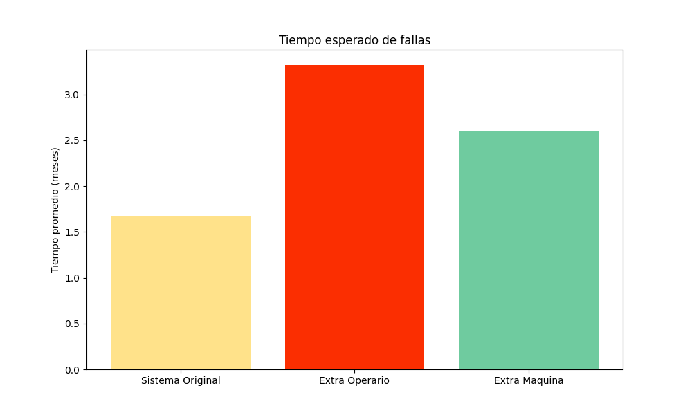

### Guillermo De Ipola, Pedro Salas

## Introducción

El problema que se quiere solucionar en este trabajo, involucra un supermercado. El supermercado tiene necesita $7$ maquinas registradoras para funcionar, y tiene $3$ máquinas de repuesto. Las maquinas fallan con una distribución exponencial con tasa de $1$ por mes. Para solucionar esto, el supermercado cuenta con un taller de reparación de maquinas operada por una persona. El tiempo de arreglo de una maquina también sigue una distribución exponencial pero con tasa de $1\over8$ por mes. 

Dado este escenario, la pregunta es la siguiente: ¿cuál es el tiempo medio de falla del supermercado? y consecuentemente, cuál de las soluciones propuestas es más efectiva, si conseguir un nuevo operario o una nueva maquina de repuesto. 

La idea sugerida por la cátedra para solucionar el problema es la siguiente: simular los tiempos de ruptura de las máquinas y también simular los tiempos de reparación cuando corresponda, luego ver cual es la menor de todas las simulaciones, y luego actualizar el estado de la simulación. En general esta idea funciona y es suficiente, pero no hace uso de la naturaleza de las distribuciones simuladas. Queriendo hacer uso de esto se nos ocurrieron dos soluciones alternativas que hacen uso de la no memoria de las variables aleatorias exponenciales.

La primera, se tiene un estado (cantidad de máquinas averiadas). Según este estado se pueden hacer tres cosas por cada iteración:

- Si hay $0$ maquinas averiadas, se genera una variable aleatoria exponencial con parámetro  $1 * 7$, que representa la próxima avería, y se suma el tiempo transcurrido.
- Si hay menos de $7$ maquinas averiadas, se generan dos variables aleatorias. Una, representando la próxima avería, y la otra representando el tiempo de reparación que puede ser  $1$  o hasta la cantidad de operarios, que también es una variable aleatoria exponencial con parámetro $R \over 8$  donde $R$ es igual a las máquinas que se están arreglando. Luego, dependiendo de qué evento sucede antes, se actualiza el estado de maquinas averiadas y se suma el tiempo transcurrido.
- Si hay más de $7$ máquinas averiadas, entonces el supermercado falla, y se termina la simulación.

En la segunda solución alternativa, iteramos sobre las reparaciones simulando el tiempo para la próxima reparación, luego simulamos las fallas dentro de ese periodo de tiempo. 

## Algoritmo y descripción de las variables

Las tres ideas que planteamos tienen los mismos 5 argumentos: `ops` que denota la cantidad de operarios del taller de reparación, `TF` que denota la tasa de fallo, `TR` que denota la tasa de reparación, `N` que denota la cantidad de máquinas que requiere el supermercado para operar, y finalmente `S` que denota la cantidad de máquinas extra con las que cuenta el supermercado. La variable `t` representa el tiempo. Hay otras variables en común, pero sus nombres son descriptivos. 

## Resultados

Tras correr los tres algoritmos descubrimos que aumentar la cantidad de operarios es la mejor forma de extender el tiempo medio de falla del supermercado. 

Los datos que se ven el gráfico fueron obtenidos simulando 10.000 veces cada escenario. Como puede verse, el tiempo de fallo agregando un operario se duplica, mientras que si se agrega una maquina de repuesto, solo crece un 50%.

Otra métrica interesante que emerge de tener tres algoritmos equivalentes, es revisar cuál es el que tiene mejor rendimiento. Para esto solo medimos tiempo, pero sabemos que es posible comprar algoritmos en otros aspectos como espacio, complejidad operacional etc.

## Conclusiones

Esta sección debe contener conclusiones globales del problema. Incluya un resumen con las conclusiones que obtuvo en la sección anterior. No olvide que un lector lee la Introducción y las Conclusiones, y si le interesa el trabajo, lee el contenido