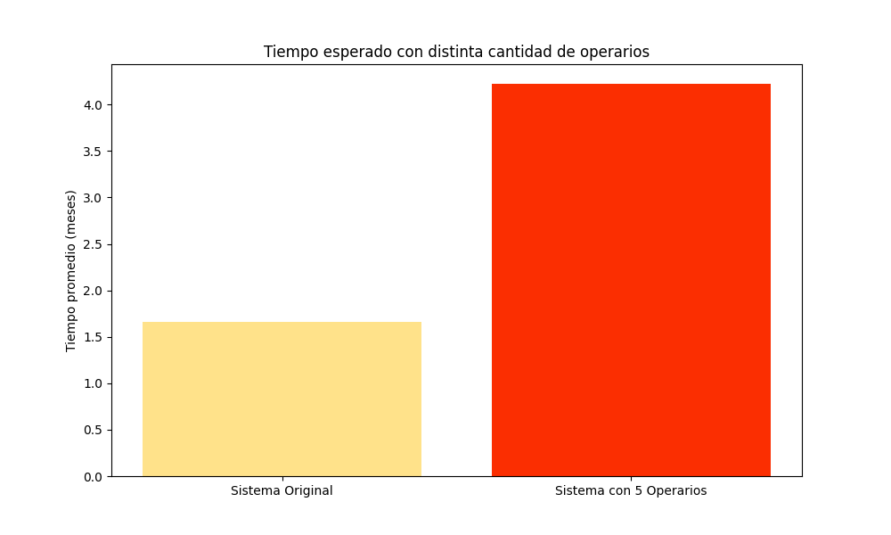
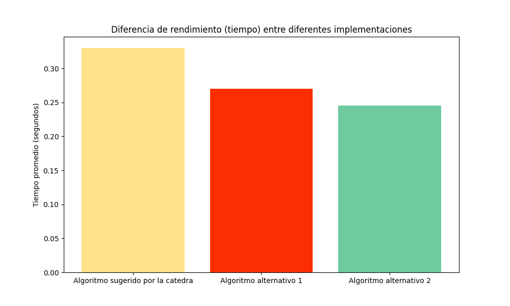

### Guillermo De Ipola, Pedro Salas

## Introducción

El problema que se quiere solucionar en este trabajo, involucra un supermercado. El supermercado tiene necesita $7$ maquinas registradoras para funcionar, y tiene $3$ máquinas de repuesto. Las maquinas fallan con una distribución exponencial con tasa de $1$ por mes. Para solucionar esto, el supermercado cuenta con un taller de reparación de maquinas operada por una persona. El tiempo de arreglo de una maquina también sigue una distribución exponencial pero con tasa de $1\over8$ por mes. 

Dado este escenario, la pregunta es la siguiente: ¿cuál es el tiempo medio de falla del supermercado? y consecuentemente, cuál de las soluciones propuestas es más efectiva, si conseguir un nuevo operario o una nueva maquina de repuesto. 

La idea sugerida por la cátedra para solucionar el problema es la siguiente: simular los tiempos de ruptura de las máquinas y también simular los tiempos de reparación cuando corresponda, luego ver cual es la menor de todas las simulaciones, y luego actualizar el estado de la simulación. En general esta idea funciona y es suficiente, pero no hace uso de la naturaleza de las distribuciones simuladas. Queriendo hacer uso de esto se nos ocurrieron dos soluciones alternativas que hacen uso de la no memoria de las variables aleatorias exponenciales.

La primera, se tiene un estado (cantidad de máquinas averiadas). Según este estado se pueden hacer tres cosas por cada iteración:

- Si hay $0$ maquinas averiadas, se genera una variable aleatoria exponencial con parámetro  $1 * 7$, que representa la próxima avería, y se suma el tiempo transcurrido.
- Si hay menos de $7$ maquinas averiadas, se generan dos variables aleatorias. Una, representando la próxima avería, y la otra representando el tiempo de reparación que puede ser  $1$  o hasta la cantidad de operarios, que también es una variable aleatoria exponencial con parámetro $R \over 8$  donde $R$ es igual a las máquinas que se están arreglando. Luego, dependiendo de qué evento sucede antes, se actualiza el estado de maquinas averiadas y se suma el tiempo transcurrido.
- Si hay más de $7$ máquinas averiadas, entonces el supermercado falla, y se termina la simulación.

En la segunda solución alternativa, iteramos sobre las reparaciones simulando el tiempo para la próxima reparación, luego simulamos las fallas dentro de ese periodo de tiempo. 

## Algoritmos y descripción de las variables

Las tres ideas que planteamos tienen los mismos 5 argumentos: `ops` que denota la cantidad de operarios del taller de reparación, `TF` que denota la tasa de fallo, `TR` que denota la tasa de reparación, `N` que denota la cantidad de máquinas que requiere el supermercado para operar, y finalmente `S` que denota la cantidad de máquinas extra con las que cuenta el supermercado. La variable `t` representa el tiempo. Hay otras variables en común, pero sus nombres son descriptivos. 

### Algoritmo sugerido (o algoritmo de Ross)

Este algoritmo no asume en ningún momento la naturaleza de las distribuciones de las variables aleatorias generadas. Es por esto que como no se conoce su naturaleza, es que este algoritmo hace lo “más lógico” o mejor dicho lo más natural para los humanos, que seria simular todo. 

Este algoritmo genera todas las variables aleatorias al mismo tiempo, es decir, una variable aleatoria con su respectiva distribución para cada elemento simulado (cada maquina y cada reparación). Luego, se avanza sobre el menor de estos tiempos. Si el menor es una ruptura, se cuenta, y se genera una nueva ruptura. Si es una reparación, se arregla una maquina y en caso de que se pueda se simula la próxima ruptura. Luego de que se “consume” el valor más chico y se hace la generación correspondiente, se ordenan los tiempos, y se vuelve a iterar. 

Esta es una solución que es válida para cualquier tipo de distribución y es por esto que tiene que hacer cosas innecesarias como mantener en memoria todos los próximos tiempos, y ordenarlos. Decimos que son innecesarias por la no memoria de las variables aleatorias exponenciales.

### Algoritmo alternativo 1 (o iteración sobre siguiente paso)

Para llegar a este algoritmo se hizo un análisis teórico del problema. Como ambos procesos (las reparaciones y las rupturas) tienen distribuciones exponenciales, se podría decir que son procesos de poisson. En particular, las reparaciones siguen esta distribución siempre que haya al menos una maquina para arreglar. Luego, se puede ver que cada ruptura es un proceso independiente, por lo que la tasa del proceso conjunto es $\lambda = \lambda_0+\lambda_1+...+\lambda_N$ siendo $\lambda_i$ la tasa de cada maquina individual. Finalmente, la próxima falla tiene distribución $F \sim \exp(\lambda)$, en particular, como $\lambda_i = T_{\text{falla}}$ entonces $\lambda = N\cdot T_{\text{falla}}$. Análogamente, se llega a que las reparaciones tienen una distribución $R \sim \exp(M\cdot T_{\text{reparacion}})$ donde $M = \min(\text{operarios },\text{maquinas averiadas})$. 

Una vez el desarrollo teórico está establecido, podemos hablar del algoritmo. La idea es en cada  momento ver cuál es el próximo evento que va a suceder. En caso de que no haya ninguna maquina averiada, solo se puede romper una maquina. Por esto, se simula una variable aleatoria con distribución $F$. En caso que haya al menos una maquina rota, se ve cuál evento sucede primero, si una ruptura o una reparación. Para esto se simulan ambos eventos con sus respectivas variables. 

Luego de que el siguiente evento se estableció, se avanza el tiempo correspondiente y se actualiza el estado de la simulación. 

En términos de legibilidad y mantenibilidad, el algoritmo es claramente superior a los otros dos, sin embargo, el salto teórico que hay que realizar para entender por qué funciona puede ser un impedimento. 

### Algoritmo alternativo 2 (o iteración sobre reparaciones)

Este algoritmo vuelve a utilizar el resultado teórico sobre las distribuciones, por lo que tampoco lleva una memoria de todos los eventos simulados. La idea de este algoritmo surge tras ver que las rupturas suceden mucho mas rápido que las reparaciones. es por esto que se genera una reparación, luego se simulan posibles fallas que “caen entre reparaciones”. 

## Resultados

Tras correr los tres escenarios con una misma implementación, descubrimos que aumentar la cantidad de operarios es la mejor forma de extender el tiempo medio de falla del supermercado. 

Los datos que se ven el gráfico fueron obtenidos simulando 10.000 veces cada escenario. Como puede verse, el tiempo de fallo agregando un operario se duplica, mientras que si se agrega una maquina de repuesto, solo crece un 50%. Por la forma en que los tres algoritmos están construidos, es fácil jugar con valores para los parámetros y ver como se modifica el tiempo de falla promedio. En el siguiente gráfico se ve uno de estos juegos, donde se compara el sistema original y un supermercado con 5 reparadores de maquinas.

Otra métrica interesante que emerge de tener tres algoritmos equivalentes, es revisar cuál es el que tiene mejor rendimiento. Para esto solo medimos tiempo medio de computo con 10000 iteraciones, pero sabemos que es posible comprar algoritmos en otros aspectos como espacio, complejidad operacional etc. 

De estas métricas podemos concluir que la mejor solución es la que itera sobre las reparaciones. Tener en cuenta que un factor no variado en estos resultados es la cantidad de maquinas. En caso de agrandar esta cantidad, el algoritmo sugerido por la cátedra perdería aún más, pues en este algoritmo constantemente hay que ordenar los valores de los tiempos simulados, entonces la complejidad temporal del algoritmo aumenta desproporcionadamente.

## Conclusiones

Luego de encontrar soluciones desde distintas perspectivas, concluimos que es más significativo para el supermercado agregar un operario que agregar una maquina de repuesto. También una conclusión importante para nosotros es analizar cuidadosamente los problemas antes de querer hacer una solución “fuerza bruta”. En este caso es útil pensar en la naturaleza de las distribuciones involucradas.